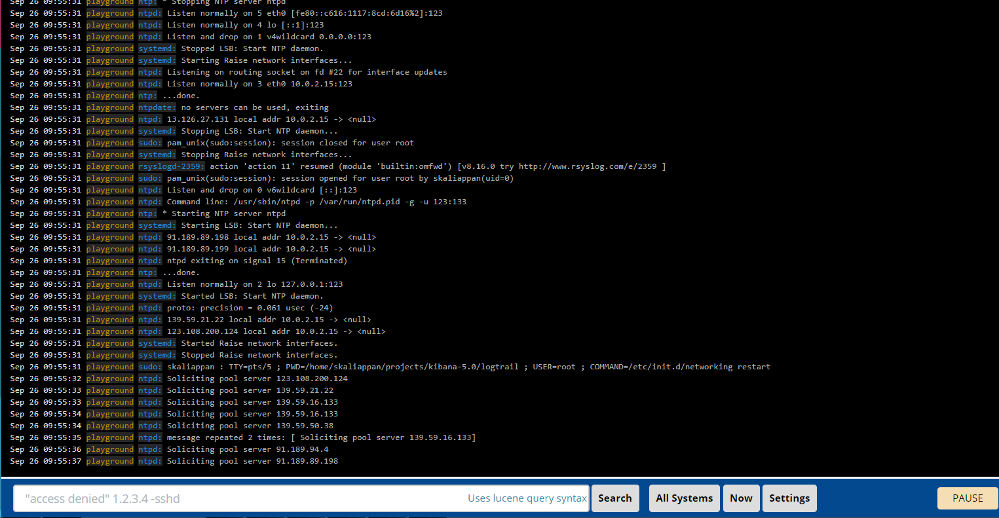

## Configuration

- Configure rsyslog to send data to logstash
  - In Ubuntu
      - As root, edit /etc/rsyslog.conf or /etc/syslog.conf to include following line at the end
      - To send syslog events using TCP `*.*  @@<logstash-agent-ip>:<port>`
      - To send syslog events using UDP `*.*        @<logstash-agent-ip>:<port>`
      - Restart rsyslog to activate the changes
        ```bash
        sudo service rsyslog restart
        ```


